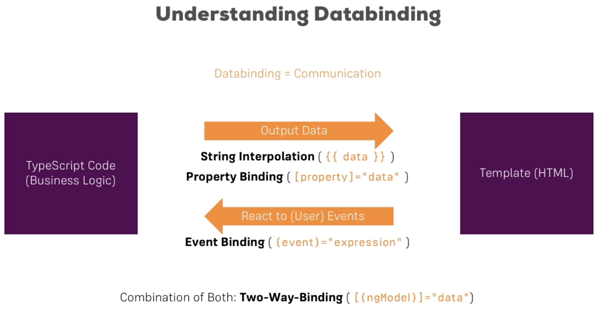
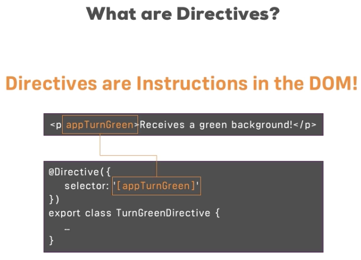

# The Basics

Example app: basics-app

## How an Angular App gets Loaded and Started?

1. Browser loads index.html file
2. Main page has the selector that points to the application component

  ```html
  <app-root></app-root>
  ```

3. Angular tries to match selector with the component:

  ```text
  @Component({
    selector: 'app-root',
    templateUrl: './app.component.html',
    styleUrls: ['./app.component.css']
  })
  export class AppComponent {
    title = 'app';
    name = '';
  }
  ```

4. To do this we need to add Angular scripts to the index.html components. This is done automatically by the `ng serve`. Having compiled and packaged all the files new scripts are created:
  
  * inline.bundle.js 
  * polyfills.bundle.js
  * styles.bundle.js
  * vendor.bundle.js
  * main.bundle.js
  

These scripts contains all code. The most important file that is executed is the **main.bundle.js** that bootstraps the **AppModule** (main application module):

```js
platformBrowserDynamic().bootstrapModule(AppModule)
  .catch(err => console.log(err));
``` 

The AppModule refers to the:

```js
@NgModule({
  declarations: [
    AppComponent
  ],
  imports: [
    BrowserModule,
    FormsModule
  ],
  providers: [],
  bootstrap: [AppComponent]
})
export class AppModule { }
```

It has the **bootstrap** array that contains all components that should be known to Angular when application starts.

## Components Introduction

### How to manually create new component?

1. Create a folder that will store the component. Good practise: folder's name should be the same as the component's name.
2. Create a file - **server.component.ts**
3. Create a component class - **ServerComponent** and export it.
4. Add annotation (decorator) - **@Component** to the class:
  * **selector: String** - name for the component, must be unique
  * **templateUrl: String** - relative path to the component template file
5. Create a template file **server.component.html** and point to it from **templateUrl** property of the **@Component**

```typescript
import {Component} from "@angular/core";

@Component({
  selector: 'app-selector',
  templateUrl: './server.component.html'
})
export class ServerComponent {
}
```

6. Go to the module to which you want add the component to and register **ServerComponent** by adding it to the **declarations** attribute of **@NgModule**

```text
@NgModule({
  declarations: [
    AppComponent,
    ServerComponent
  ],
  ...
})
```

7. Use the \<server-component> (selector/name of the component) within another component.

> Module - Bundle of functionalities, ...

### How to automatically create new component?

1. Type: ``ng generate component <component-name>`` or ``ng g c <component-name>``


### How to add styles to component?

```text
@Component({
    ...
    styleUrls: ['./app.component.css'],
    styles: [`
      h1 {
        color: lightblue;
      } 
    `]
})
```

### Components properties

* **selector: String** (required) - name of the component, must be unique, there are few types of selector
  * 'name' - element selector
  * '[name]' - attribute selector
  * '.name' - class selector
* **templateUrl: String** (required, or template)- relative path to the template file
* **template: String** (required, or templateUrl) - components content (the same as template file, but written in String)
* **styleUrls: Array** - relative paths to css files
* **styles: Array** - inline styles for component


## Databindings

**Databinding** - communication between components code (business logic) and html representation



### String Interpolation

String interpolation's expression can be anything that can be casted to String. It can also be a ternary expression (but no other flow control statement).

Syntax: 

```text
{{ expression }}
```

Example:

```html
<p>Server with ID {{ serverId }} is {{ serverStatus }} (with method: {{ getServerStatus() }})</p>
```

### Property Binding

Used for binding HTML attributes that should be able to change its value.

Syntax:

```text
[attribute]="value"
```

Example:

```html
<button class="btn btn-primary" [disabled]="allowNewServer">Add Server</button>
```


### Event Bindings

Event binding are used to handle events. You can bind to all properties and events that are eligible for particular element.

**How to create Event Binding?**

1. Create Event Handler in the component:

```js
onCreateServer() {
    this.serverCreationStatus = 'Server was created!';
}
```

2. Set Event Handler for specific event:

```html
<button ...
        (click)="onCreateServer()">
  Add Server
</button>
```

> IMPORTANT: For event we bind be **event's name** not **on...**

**How to pass data to event handler?**

The event object can be passed to the event handler through **$event** object. This object is automatically created when event is triggered. **$event** will be the data emitted for that event.


Example:

Add in the component's template:

```html
<input id="name" type="text" (input)="onUpdateServerName($event)"/>
```

Add in the component's code (.ts):

```js
onUpdateServerName(event) {
    console.log(event.target.value);
}
```

or

```js
onUpdateServerName(event: Event) {
    this.serverName = (<HTMLInputElement> event.target).value;
}
```

### Two-way binding - ngModel

To be able to use ngModel, the **FormModule** needs to be added to the **imports[]** array in the module the component resides in.

Syntax:

```text
[(ngModel)]="<property_name>"
```

Example:

First create **serverName** property in the component and then add in the component's template:

```html
<input id="name" type="text" [(ngModel)]="serverName" />
```

## Directives

Directives - instructions in the DOM (instructions to replace particular selector, value etc. with some logic, for example: components are directives with a template)



### Built-in directives

**Structural directive**
* Changes the structure of the DOM
* Prefixed with *

**ngIf**
* Structural Directive
* Conditionally adds or removes element from the DOM
* Can be used with else statement with local reference to some template

```html
<p *ngIf="serverCreated">
  Server was created! Name is {{serverName}}
</p>
```

```
<p *ngIf="serverCreated; else noServer">
  Server was created! Name is {{serverName}}
</p>

<ng-template #noServer>
  <p>
    No server was created!
  </p>
</ng-template>
```

**ngFor**

* Attribute directive
* Expression syntax: **let <variable_name> of <array>; let i = index**
* It is set to the element that should be replicated
* Accessing current iteration index: **let i = index** (start at 0)

```
<app-server *ngFor="let server of servers"></app-server>
```

**Attribute directives**

* Attribute directives do not add or remove elements
* They change the element they were placed on
* Used with square brackets

> IMPORTANT: Square brackets are not the part of the directive name. Square brackets indicate that we want to bind to some property on this directive and this property happens to also be the same name as directive name.

**ngStyle**

* Expects JS object
* Dynamically updates the styles of the elements

```html
<p [ngStyle]="{backgroundColor: getColor()}">
  Server with ID {{ serverId }} is {{ serverStatus }} (with method: {{ getServerStatus() }})
</p>
```


**ngClass**

* Expects JS object:
    * Key - the class name
    * Value - boolean that points if the class should be added or not
* Dynamically adds or removes classes from elements

```
<p [ngClass]="{online: serverStatus === 'online'}">
    {{ getServerStatus() }}
</p>
```


### Local References

* Starts with #

```
<ng-template #noServer>
  <p>
    No server was created!
  </p>
</ng-template>
```