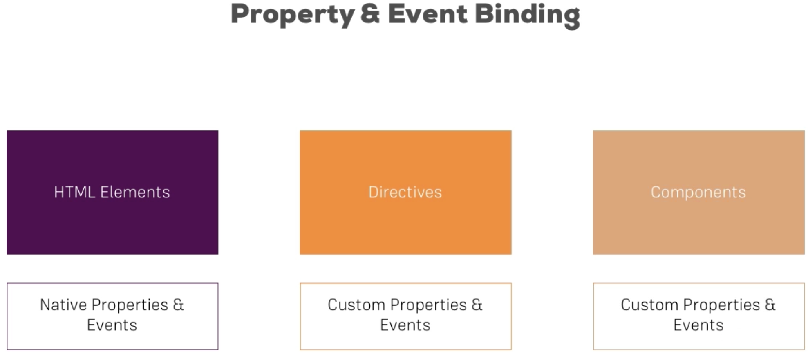

# Components and Databindings

Example app: databindings-app

## Property & Event Binding Overview



## Binding to Custom Properties - Property Binding Between Components

We need to pass single server from AppComponent to ServerElementComponent in order to show some details

1. Create a property in ServerElementComponent that will serve as a server and decorate it with **@Input()** annotation

```typescript
@Input()
    element: {
        type: String,
        name: String,
        content: String
    };
```

2. Go to the **app.component.html** and pass the server object to the **app-server-element** component using **Property Binding**. The name must match the name of the variable:

```html
<app-server-element
        *ngFor="let server of serverElements"
        [element]="server">
</app-server-element>
```

3. (Optional) Create an alias for element - the name that this element will be represented outside of the component:

```typescript
@Input("serverElement")
    element: {
        type: String,
        name: String,
        content: String
    };
```

```html
<app-server-element
        *ngFor="let server of serverElements"
        [serverElement]="server">
</app-server-element>
```

## Binding to custom events - Passing events from child to parent component

We want to emit event that will inform parent component that some state has been changed.

1. Create an event callbacks in the parent component (AppComponent)

```typescript
onServerAdded(serverData: { serverName: string, serverContent: string }) {
    this.addServer('server', serverData);
}

onBlueprintAdded(blueprintData: { serverName: string, serverContent: string }) {
    this.addServer('blueprint', blueprintData);
}
```

This event callbacks are functions that receives as argument data required to fulfil business logic.

2. Create Event Emitters in child component (CockpitComponent) and decorate them with **@Output()** annotation

```
@Output()
serverCreated = new EventEmitter<{ serverName: string, serverContent: string }>();

@Output()
blueprintCreated = new EventEmitter<{ serverName: string, serverContent: string }>();
```

EventEmitter is a generic type that takes as a type parameter class/blueprint that represents the data object emitted by the event. For example here we want to emit as a data an object that has two string properties (these attributes are required to fulfil parent's component contract/business logic)

3. Create Event Handlers for events triggered within a child component (CockpitComponent)

```typescript
onAddServer() {
    this.serverCreated.emit({
        serverName: this.newServerName,
        serverContent: this.newServerContent
    });
}

onAddBlueprint() {
    this.blueprintCreated.emit({
        serverName: this.newServerName,
        serverContent: this.newServerContent
    });
}
```

These event handlers will use the event emitters to inform 'subscribers' that event occurred.

4. Go to the parent's component template - **app.component.html** - and pass Event Callbacks (functions from parent component) as the subscribers to event. This is done by binding the EventEmitter from child component with callback from parent component:

```html
<app-cockpit
    (serverCreated)="onServerAdded($event)"
    (blueprintCreated)="onBlueprintAdded($event)">
</app-cockpit>
```

> IMPORTANT: Passed **$event** object is the data emitted through **emit(...)** method

5. (Optional) Enable alias in the same way as for **@Input()**

```
@Output('alias')
```

## View Encapsulation

Default behavior: Each component has its own styles set. This is achieved by creating unique attributes for components and changing the selector to match element with the attribute.

**How to change default behavior?**

1. Override **encapsulation** attribute from **@Component**
2. Possible values:
    * ViewEncapsulation.Emulated - (default) each component has separate set of styles
    * ViewEncapsulation.None - styles defined in the component will be applied globally (no encapsulation)
    * ViewEncapsulation.Native - uses Shadow DOM

```
@Component({
    ...,
    encapsulation: ViewEncapsulation.None
})
```

## Using Local References in Templates

* Useful when we do not need to create two-way binding, we need to get the value of the input element to perform some logic.
* Can be placed on **any** HTML element
* Local References can be used ONLY in the HTML template, not in the
* Syntax: **#\<name>**

### How to use Local References?

1. Create Local Reference to some element in the template:

```
<input type="text"
               class="form-control"
               #serverNameInput>
```

2. Pass it as the attribute to the method (this is an HTML element)

```
<button
        class="btn btn-primary"
        (click)="onAddServer(serverNameInput)">Add Server
</button>
```

3. Get the value of the element (do sth with them):

```
onAddServer(serverNameInput: HTMLInputElement) {
    this.serverCreated.emit({
        serverName: serverNameInput.value,
        serverContent: this.newServerContent
    });
}
```

## Getting access to Local References & DOM from the component

1. Create a Local Reference in the HTML template:

```
<input type="text"
               class="form-control"
               #serverContentInput>
```

2. Create property of **ElementRef** type in the component and decorate it with **@ViewChild**

```
@ViewChild('serverContentInput')
serverContentInput: ElementRef;
```

3. The **@ViewChild** can be passed a name to the Local Reference or the class of the component that we want to refer to.
4. Get the value of the element through **nativeElement** property:

```
onAddServer(serverNameInput: HTMLInputElement) {
    this.serverCreated.emit({
        serverName: serverNameInput.value,
        serverContent: this.serverContentInput.nativeElement.value
    });
}
```

## ng-content - Projecting Content into Components

When using another component Angular by default will remove the content defined within the opening and closing tag of the parent.

```
<app-server-element>
    CONTENT BY DEFAULT WILL BE REMOVED WHEN REPLACED BY <app-server-component>
</app-server-element>
```

In order to change that behavior we need to use **ng-content**.

1. Place the **\<ng-content>** element in the child component (server-element) which we want to pass the content to

```
<div class="panel-body">
    <ng-content></ng-content>
  </div>
```

2. Add the content within the opening and closing tags of the component in the parent component (app-component)

```
<app-server-element
        *ngFor="let server of serverElements"
        [serverElement]="server">
    <p>
        <strong *ngIf="server.type === 'server'" style="color: red">{{ server.content }}</strong>
        <em *ngIf="server.type === 'blueprint'">{{ server.content }}</em>
    </p>
</app-server-element>
```

## Component Lifecycle

* **ngOnChanges** - called after a bound input property changes (multiple times)
* **ngOnInit** - called once the component is initialized (after the constructor)
* **ngDoCheck** - called during every change detection run
* **ngAfterContentInit** - called after content (ng-content) has been projected into view
* **ngAfterContentChecked** - called every time the projected content has been changed
* **ngAfterViewInit** - called after the component's view (and child views) has been initialized
* **ngAfterViewChecked** - called every time the view (and child views) have been checked
* **ngOnDestroy** - called once the component is about to be destroyed